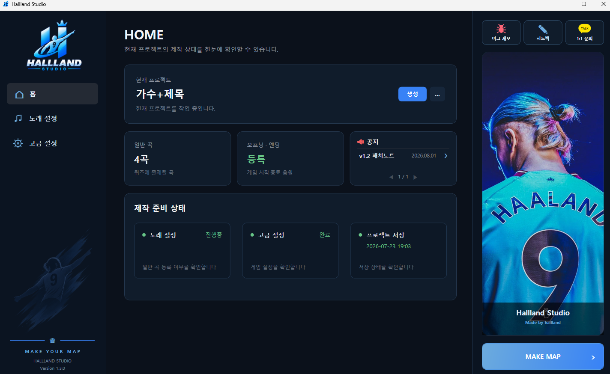

# Hallland Studio

> 스타크래프트 음악 맞히기 유즈맵을 누구나 쉽고 직관적으로 제작할 수 있는 통합 제작 도구

Hallland Studio는 복잡한 Excel, EPS 파일을 직접 수정하지 않고도
노래 등록부터 음원 처리, 게임 설정, 맵 빌드까지 하나의 프로그램에서 진행할 수 있도록 만든
Windows 데스크톱 애플리케이션입니다.

맵 제작 경험이 없는 사용자도 필요한 내용을 입력하고 설정하는 것 만으로
노래 맞히기 map을 제작할 수 있도록 직관적인 GUI 환경을 제공합니다.

---

## ✨ 주요 기능

- 🎵 노래 목록 등록 및 편집
- 🎤 제목 맞히기 / 제목 + 가수 맞히기 모드
- 📥 YouTube 음원 자동 다운로드
- 🔊 음원 정규화(음질,음량) 및 OGG 자동 분할
- 🎬 오프닝 · 엔딩 , 수록 곡 설정
- ⚙️ eps 파일 연동으로 사용자가 코드를 보지 않고 세부 설정
- 🗺️ SCPM의 지형 변환 기능을 프로그램 내부에서 직접 호출해 image 파일 minimap 적용
- 💾 프로젝트 저장 및 불러오기
- 🫳 EUDDraft 기반 One-Click 맵 빌드
- 🔄 GitHub Releases 기반 자동 업데이트
- 🐞 버그 제보 및 기능 피드백 요청

---

## 📸 Hallland Studio v1.4

---

## 🚀 사용 방법

1. Hallland Studio를 실행합니다.
2. 새 프로젝트를 생성합니다.
3. 출제할 노래를 등록합니다.
4. 오프닝 · 엔딩 및 게임 설정을 입력합니다.
5. `MAKE MAP` 버튼을 누릅니다.
6. 컷팅 할 시간을 Norwayworker 에 입력하면 음원 다운로드 및 음량,음질 정규화가 진행됩니다.
7. 생성된 `.scx` 맵 파일을 확인합니다.

### 📖 자세한 사용법

- Hallland Studio 설명서: https://cafe.naver.com/edac/142382
- NorwayWorker 설명서: https://cafe.naver.com/edac/142318

---

## 📥 다운로드

오른쪽의 **Releases** 메뉴에서 최신 버전의 Hallland Studio를 다운로드할 수 있습니다.

Hallland Studio는 업데이트가 필요한 경우 자동으로 새 버전을 확인하며,
Patcher를 통해 최신 버전으로 업데이트할 수 있습니다.

---

## 💻 시스템 요구 사항

- Windows 10 / 11
- 64비트 운영체제
- 인터넷 연결
- .NET 8.0

---

## 📌 현재 버전

**Hallland Studio v1.4**

